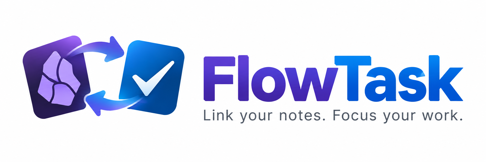

<p align="center">
  
</p>

# FlowTask For Super Productivity

<p align="center">
  <strong>Capture, synchronize, and complete Super Productivity tasks without leaving Obsidian.</strong>
</p>

<p align="center">
  <a href="https://www.buymeacoffee.com/giba"></a>
</p>

FlowTask connects Obsidian, your place for notes and continuous thinking, to [Super Productivity](https://super-productivity.com/), your place for execution and task state.

## Contents

- [What it does](#what-it-does)
- [Requirements](#requirements)
- [Installation](#installation)
- [First-time setup](#first-time-setup)
- [Import tasks from notes](#import-tasks-from-notes)
- [Obsidian Tasks compatibility](#obsidian-tasks-compatibility)
- [Quick capture](#quick-capture)
- [Task panel](#task-panel)
- [Tracking tasks](#tracking-tasks)
- [Command Palette commands](#command-palette-commands)
- [Connection and fallback](#connection-and-fallback)
- [Settings reference](#settings-reference)
- [Troubleshooting](#troubleshooting)
- [Development](#development)
- [Contributing](#contributing)
- [Release process](#release-process)
- [Privacy and security](#privacy-and-security)
- [Limitations](#limitations)
- [License](#license)

## What it does

FlowTask provides three complementary workflows:

1. Import an Obsidian checkbox into Super Productivity while writing a note.
2. Create a task quickly from a configurable command or hotkey.
3. Browse, search, group, track, pause, resume, complete, and delete Super Productivity tasks from an Obsidian sidebar.

The integration is deliberately local-first. The primary transport is the Super Productivity Local REST API. When the local app is unavailable, optional file-based fallback queues commands in a vault folder that can be synchronized by your preferred sync service.

## Requirements

- Obsidian Desktop 1.5.0 or later.
- Super Productivity with the Local REST API enabled.
- A local Super Productivity API URL, normally `http://127.0.0.1:3876`.
- A token only when the installed Super Productivity version displays and requires one.

FlowTask is desktop-only because it uses the Obsidian desktop request API and a local application endpoint.

## Installation

### Community plugins

After FlowTask is accepted into the Obsidian community plugin directory:

1. Open **Settings** in Obsidian.
2. Open **Community plugins**.
3. Search for **FlowTask For Super Productivity**.
4. Install and enable the plugin.

### Manual installation

Download `main.js`, `manifest.json`, and `styles.css` from a GitHub release and copy them into:

```text
<vault>/.obsidian/plugins/flowtask-super-productivity/
```

Then reload Obsidian and enable **FlowTask For Super Productivity** under **Settings > Community plugins**.

### Development installation

Clone the repository, build the plugin, and copy the generated files into the vault plugin directory:

```bash
git clone https://github.com/giba0/obisidan-flowtask-sp.git
cd obisidan-flowtask-sp
npm install
npm run build
```

Copy `main.js`, `manifest.json`, and `styles.css` into the plugin directory described above. Rebuild after source changes and reload the plugin in Obsidian.

## First-time setup

1. Open **Settings > FlowTask For Super Productivity**.
2. Set **Base URL**. The default is `http://127.0.0.1:3876`.
3. Set **Access token** only if Super Productivity shows one under **Settings > Misc > Local REST API**.
4. Click **Test connection**.
5. Confirm that the status in the FlowTask panel changes to **connected**.

Recent Super Productivity versions may not require a token for local loopback requests. Leave the field empty in that case. FlowTask never sends an empty `Authorization` header. When a token is configured, FlowTask sends `Authorization: Bearer <token>` on authenticated task, project, tag, and task-control requests. The `GET /health` check is always sent without an authorization header.

## Import tasks from notes

The default import tag is `#sp`. A checkbox must contain the configured import tag to be sent to Super Productivity:

```markdown
- [ ] Review the release notes #sp
```

A normal checkbox without the import tag is left untouched:

```markdown
- [ ] This remains an Obsidian-only checklist item
```

The import tag is configurable under **Settings > FlowTask For Super Productivity > Import tag**. The value may be entered as `sp` or `#sp`; FlowTask normalizes both forms.

### Supported note metadata

```markdown
- [ ] Review the release +Engineering #sp 📅 2026-09-20 30m
```

Supported metadata includes:

- `+Project` resolves an existing Super Productivity project.
- `#tag` resolves an existing Super Productivity tag.
- `@today`, `@tomorrow`, `@next monday`, and `@next week` resolve relative dates.
- `@YYYY-MM-DD` and `@YYYY/MM/DD` resolve explicit dates.
- `30m`, `1h`, and `2d` define an estimate.
- `📅 YYYY-MM-DD` is the due-date syntax used by the Obsidian Tasks plugin.
- `⏳ YYYY-MM-DD` is also accepted as a date marker.

Projects and tags are resolved only when they already exist in Super Productivity. FlowTask never creates projects or tags through the API. An unresolved project or tag is preserved as literal task text instead of silently creating the wrong entity.

### Task identity marker

After successful import, FlowTask appends an inline Obsidian comment:

```markdown
- [ ] Review the release #sp %%sp-id:task-id%%
```

The marker is hidden in Live Preview and Reading View and remains visible in Source/Code mode. It makes synchronization idempotent and connects the note checkbox to the remote task. Legacy `<!--sp-id:...-->` markers are still recognized and migrated automatically during synchronization.

### Completion synchronization

- Checking the note checkbox completes the linked Super Productivity task.
- Completing the task in Super Productivity checks the linked note checkbox.
- Reopening the task in Super Productivity unchecks the linked note checkbox.
- Remote completion synchronization runs during polling even when the FlowTask panel is closed.

## Obsidian Tasks compatibility

FlowTask is compatible with the common Obsidian Tasks format:

```markdown
- [ ] Prepare the demo #sp 📅 2026-09-21
```

The task remains a normal Obsidian Tasks item. FlowTask only adds its hidden identity marker and sends the due date to Super Productivity as `dueDay`.

See the official Tasks documentation for the full Tasks syntax:

<https://publish.obsidian.md/tasks/Introduction>

## Quick capture

Open **FlowTask: Quick capture** from the Command Palette or assign your own hotkey under **Settings > Hotkeys**.

Enter a task using this syntax:

```text
Buy milk +Home #shopping @tomorrow 15m
```

The modal provides:

- Project autocomplete after `+`.
- Tag autocomplete after `#`.
- Date suggestions after `@`.
- Keyboard navigation with Up, Down, and Enter.
- A live preview showing the resolved date and estimate.
- An option to attach an `obsidian://` link to the current note.

Quick capture uses `#tag` because it is an isolated modal. Note import uses the configured routing tag and remains compatible with normal Obsidian note syntax.

## Task panel

Open the panel with the ribbon icon, the Command Palette, or **FlowTask: Open panel**.

### Views

- **All** shows active tasks.
- **Today** shows tasks due today.
- **Upcoming** shows future scheduled tasks.
- **Overdue** shows tasks whose due date has passed.
- **No date** shows tasks without a due date.

### Filters

The **Filters** menu provides:

- All tasks.
- Inbox.
- Archived tasks.
- Include completed tasks.

### Search

The search field uses fuzzy matching across:

- Task titles.
- Task notes.
- Project names.
- Tag names.

Searching `rpr` can match a task such as `Review pull request` without requiring an exact phrase.

### Grouping

Use the grouping selector to group tasks by:

- Project.
- Due date.
- Tag.

Click a group header to collapse or expand it. Use the `⋮⋮` handle to drag project groups into a preferred order. Inbox is always placed first. Custom project order is stored in FlowTask settings and affects only the FlowTask presentation.

### Task cards

Each card can show:

- Completion checkbox.
- Due date.
- Tags.
- Time already invested.
- Start, pause, or resume action.
- Delete action.

Tasks with subtasks display a `▾` or `▸` control beside the title. The control collapses or expands the child tasks without hiding the parent.

## Tracking tasks

The tracking action reflects the actual current task reported by Super Productivity:

- `Start` starts tracking a task with no recorded time.
- `Resume (time)` starts tracking a task that already has recorded time.
- `Pause` stops the current task through `POST /task-control/stop`.

Time values are read in the millisecond format used by Super Productivity and displayed as seconds, minutes, or hours.

Starting a task does not guarantee starting a Pomodoro or focus session. Super Productivity does not expose a guaranteed external focus-session API; focus behavior depends on the application's own configuration.

## Command Palette commands

FlowTask registers independent commands so each can receive its own Obsidian hotkey:

- **FlowTask For Super Productivity: Quick capture**
- **FlowTask For Super Productivity: Sync current line**
- **FlowTask For Super Productivity: Open panel**
- **FlowTask For Super Productivity: Refresh tasks**
- **FlowTask For Super Productivity: View today's tasks**

Configure hotkeys under **Settings > Hotkeys**.

## Connection and fallback

### Local REST transport

FlowTask uses Obsidian's `requestUrl()` API rather than browser `fetch()`. This avoids sending an `Origin` header that the Super Productivity local API rejects.

The REST transport uses these endpoints:

- `GET /health`
- `GET /tasks`
- `POST /tasks`
- `PATCH /tasks/:id`
- `DELETE /tasks/:id`
- `GET /projects`
- `GET /tags`
- `POST /tasks/:id/start`
- `GET /task-control/current`
- `POST /task-control/stop`

### File fallback

When enabled, offline task operations are written atomically below the configured folder:

```text
FlowTask/
  commands/
  events/
  processed/
  state/snapshot.json
```

The fallback is intended for an optional companion integration or a synchronized vault workflow. It does not pretend that a local REST operation succeeded.

## Settings reference

### Base URL

The Super Productivity Local REST API URL. Default: `http://127.0.0.1:3876`.

### Access token

Optional. Leave empty when your local SP API does not require authentication. If your SP version displays or requires a token, enter it here. FlowTask sends `Authorization: Bearer <token>` on authenticated task, project, tag, and task-control requests; `GET /health` is always unauthenticated.

### Refresh interval

Polling interval from 2 to 30 seconds. The default is 5 seconds. FlowTask also refreshes when the Obsidian window regains focus.

### File fallback

Enables or disables the JSON command queue used while Super Productivity is unavailable.

### Fallback folder

Vault-relative folder used by the file transport. The default is `FlowTask`.

### Default project

Optional existing Super Productivity project name used when a newly created task does not specify a project.

### Import tag

The routing tag used by the checkbox watcher. Default: `#sp`.

## Troubleshooting

### The panel says that Super Productivity is unavailable

1. Confirm that Super Productivity is running.
2. Confirm the Base URL and port.
3. Run `curl http://127.0.0.1:3876/health`.
4. Add the access token if your SP version requires one.
5. Click **Test connection** in FlowTask settings.

### Tasks are not imported from a note

1. Confirm that the checkbox contains the configured import tag, normally `#sp`.
2. Confirm that the line starts with an Obsidian checkbox such as `- [ ]`.
3. Use **FlowTask: Sync current line** to process the current line immediately.
4. Check the note source for the hidden `%%sp-id:...%%` marker.

### The task has no date in Super Productivity

Use a supported date marker:

```markdown
- [ ] Task #sp 📅 2026-09-20
```

Do not use a locale-formatted date such as `20/09/2026` when creating a task from the note.

### The task shows `##sp`

Update to the latest plugin build. FlowTask normalizes legacy tag settings and prevents the routing tag from being appended as a second hash-prefixed tag. Existing tasks already containing `##sp` must be edited once in Super Productivity.

### The panel does not show completed tasks

Open **Filters** and enable **Include completed**.

## Development

### Prerequisites

- Node.js 18 or later.
- npm.
- Obsidian Desktop for manual runtime testing.
- A local Super Productivity instance for API integration testing.

### Install dependencies

```bash
npm install
```

### Run checks

```bash
npm run typecheck
npm test
npm run build
```

The test suite covers:

- Multi-timezone date parsing.
- Obsidian Tasks date syntax.
- REST response envelopes.
- Bearer header presence and omission.
- Super Productivity task field mapping.
- Start and pause endpoint mapping.
- Fuzzy search and task presentation.
- File fallback writes.
- Tag normalization and autocomplete.

### Build output

`npm run build` creates the Obsidian distribution bundle at the repository root:

```text
main.js
manifest.json
```

Do not commit `node_modules`. The generated `main.js` is part of a release and should be committed with the release tag.

### Versioning

FlowTask follows [Semantic Versioning](https://semver.org/). Use the version scripts from the repository root:

```bash
npm run version:patch  # bug fixes and compatible changes
npm run version:minor  # backwards-compatible features
npm run version:major  # breaking changes
```

Each script updates the version in `package.json`, `package-lock.json`, and `manifest.json`. Run the validation suite, commit the version change, and create a tag matching the new version. Pushing a `major.minor.patch` tag triggers the GitHub release workflow.

### Project structure

```text
src/domain/       Pure parsing, dates, search, tags, and presentation logic
src/transport/    REST and file transports
src/ui/           Sidebar and Quick Capture UI
src/watcher.ts    Checkbox import and bidirectional synchronization
src/main.ts       Obsidian lifecycle, commands, settings, and polling
tests/            Unit and integration-seam tests
```

## Contributing

Before opening an issue, search existing issues and confirm that you are using the latest release.

### Report a bug

Open a [bug report](https://github.com/giba0/obisidan-flowtask-sp/issues/new) with:

- Obsidian version.
- Super Productivity version.
- Operating system.
- FlowTask version.
- Whether a token is configured.
- Minimal note/task input that reproduces the issue.
- Expected behavior and actual behavior.
- Relevant console output with secrets removed.

Never include an access token, private note contents, or personal task data in an issue.

### Request an improvement

Describe the user problem before proposing the implementation. Include:

- The workflow that is currently difficult.
- The smallest useful behavior.
- How the behavior should work offline.
- Whether it affects the REST API, note syntax, panel, or settings.

### Pull requests

1. Fork the repository.
2. Create a focused branch from `main`.
3. Keep changes small and explain the user-facing behavior.
4. Add or update tests for behavior changes.
5. Run `npm run typecheck`, `npm test`, and `npm run build`.
6. Update the README when settings, commands, syntax, or limitations change.
7. Open a pull request with a clear summary and validation results.

Pull requests should not include secrets, vault data, `node_modules`, or unrelated formatting changes. A maintainer may request changes before merging.

See [CONTRIBUTING.md](CONTRIBUTING.md) for the full development and review policy.

## Release process

Maintainers should:

1. Update the version in `manifest.json` and `package.json`.
2. Run the typecheck, test suite, and production build.
3. Confirm that `main.js`, `manifest.json`, and `styles.css` are at the repository root.
4. Review the README and changelog.
5. Create a Git tag matching the manifest version, for example `0.1.0`.
6. Create a GitHub release containing `main.js`, `manifest.json`, and `styles.css`.
7. Submit the plugin through the official Obsidian community plugin submission process.

Official Obsidian submission documentation:

<https://docs.obsidian.md/plugins/releasing/submit-plugin>

The submission metadata must match the released `manifest.json`. The repository must be public, the plugin must have stable root-level `main.js`, `manifest.json`, and `styles.css` files, and the release version must match the manifest version.

## Privacy and security

FlowTask does not use a hosted account or telemetry service. It sends task data to the configured Super Productivity Local REST API and writes fallback commands to the configured vault folder.

Do not publish:

- Super Productivity access tokens.
- Private vault content.
- Private task data.
- Personal API request logs containing authorization headers.

For security reports, see [SECURITY.md](SECURITY.md) instead of opening a public issue.

## Limitations

- Project and tag creation through the Super Productivity API is not supported.
- Focus/Pomodoro sessions cannot be guaranteed through the external task API.
- The file fallback requires a companion process or integration to consume its command queue.
- Project ordering is a FlowTask presentation preference and does not reorder projects in Super Productivity.
- The plugin is desktop-only.

## License

FlowTask For Super Productivity is distributed under the [MIT License](LICENSE).

## Support the project

If FlowTask improves your workflow, you can support development:

<a href="https://www.buymeacoffee.com/giba"></a>
